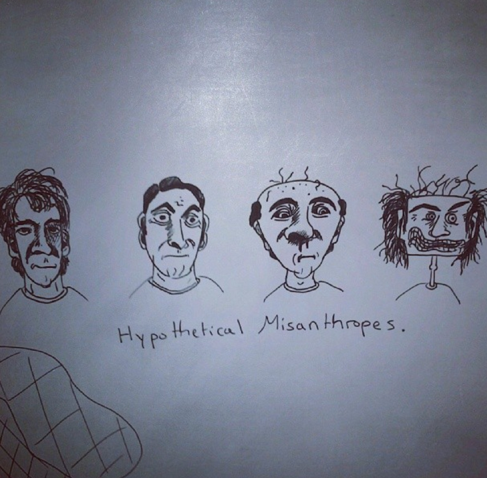

# Rekognition image pipeline

During Stephane Maarek's AWS Certified Data Engineer - Associate course on Udemy, there was a hands on lesson for AWS CDK that I opted to try in Terraform. This repo is the result. Certainly not a module nor really intended to be reused by others. It was originally just labels and 1 image at a time, but I changed it to get more info (labels, faces, text, celebrities) for all images.

The gist of it is that you drop an image in an S3 bucket, a Lambda is triggered that uses Rekognition to get image info, and the info is persisted to DynamoDB.

Various resource names are outputted in case you want to reference them in CLI commands.

## Putting files in s3

Just one image:

`aws s3 cp <path_to_specific_image> s3://<s3_bucket_name>`

Bulk:

`aws s3 sync <path_to_image_folder> s3://<s3_bucket_name>`

## Viewing logs

`aws logs filter-log-events --log-group-name /aws/lambda/<lambda_function_name>`

## Viewing data in table

`aws dynamodb scan --table-name <dynamodb_table_name>`

I'm sure you can write a query yourself if you have more data in your table already.

### Just for laughs

Detect celebrities on the `hypothetical_misanthropes.jpg` image in this repo pinged Giulio Cali (80% confidence, but 91% confident that he's calm):

